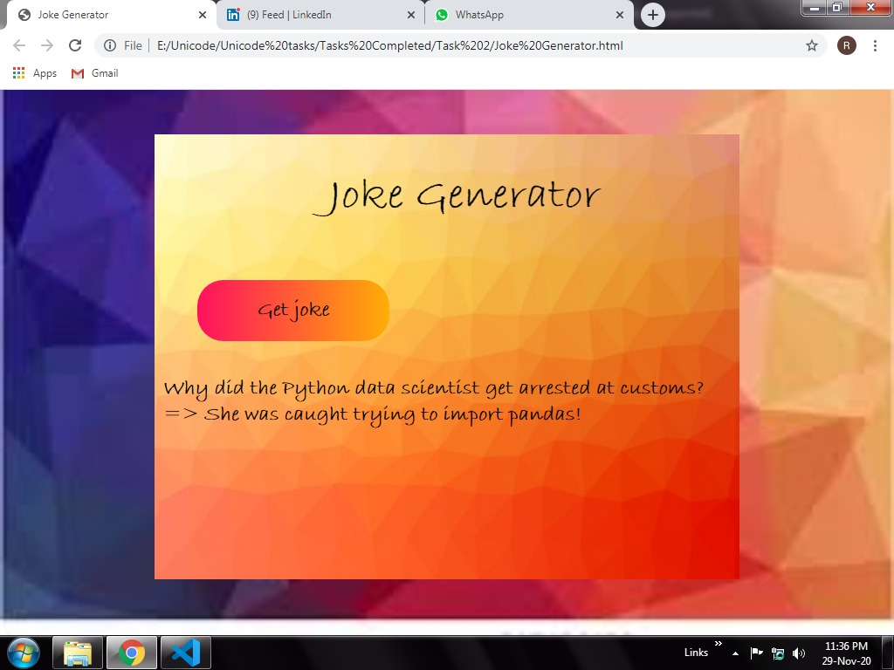

# Joke Generator

## Project Structure

```
.
├── images/                 -> Contains images for background
├── Joke Generator.html     -> The main HTML File(Javascript included)
├── style.css               -> CSS file 
└── package.json            -> Npm package.json file
```
## About
```
Random Jokes are fetched from the jokes api using Axios .
If you have something to cotribute to designing of it , You're most welcome !!!
```

## Output

